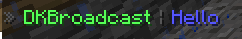

# Broadcast

DKBans V5 brings a completely redesigned broadcast system with more possibilities and flexibility to your server
or network.

***

## **Quickstart**

### 1. Create a broadcast

First you need to create a new broadcast. 

```/broadcast <name> create <visibility> <text>``` ([More information](../plugin-usage/commands/broadcast-commands.md#broadcast-name-create-visibility-text))

We will use this command and type this: ``/broadcast MyBroadcast create chat Hello``
This will create a broadcast named ``MyBroadcast`` and it will be shown in the ``chat`` with the message `Hello`.

### 2. Testing the broadcast

After we create a broadcast, we can test it with directly sending the broadcast to all players.

```/broadcast <name> direct``` ([More information](../plugin-usage/commands/broadcast-commands.md#broadcast-name-direct))

We will use this command: ``/broadcast MyBroadcast direct``

In your chat, this should be displayed:


### 3. Create a broadcast group

After this we create a broadcast group to send the configured broadcasts in a specified interval.

``/broadcastgroup <name> create <inverval>`` ([More information](../plugin-usage/commands/broadcast-group-commands.md#broadcastgroup-name-create-interval))

We will use this command: ``/broadcastgroup MyBroadcastGroup create 1``
This creates a new broadcast group with the name ``MyBroadcastGroup`` and all assigned broadcasts will be broadcast every second.

Now we only have to assign our previous created broadcast ``MyBroadcast`` to this broadcast group.

### 4. Assign the broadcast to the broadcast group

``/broadcastgroup <name> assignment <broadcast> add`` ([More information](../plugin-usage/commands/broadcast-group-commands.md#broadcastgroup-name-assignment-broadcast-add))

We will use this command: ``/broadcastgroup MyBroadcastGroup assignment MyBroadcast add``

Now every broadcast in this group should be displayed every second in the chat.

### 5. Change the interval of the broadcast group

It's very annoying for your players to broadcast them every second the broadcast, so we will increase the interval.

``/broadcastgroup <name> edit interval <interval>``  ([More information](../plugin-usage/commands/broadcast-group-commands.md#broadcastgroup-name-edit-action-value))

We will use this command: ``/broadcastgroup MyBroadcastGroup edit interval 60``

This will change the interval to one minute.

### Adding new broadcasts to this broadcast group

If you want to add more broadcasts to this broadcast group, you need to do the steps [1](#1-create-a-broadcast) and [4](#4-assign-the-broadcast-to-the-broadcast-group) again.