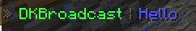

# Broadcast

The new broadcast system in DKBans V5 is totally redesigned and brings new functionalities. With the new system you have many new
visualization types (e.g. boss bar, chat, action bar) available and can schedule them per server.


***

## **Broadcast**

A broadcast is something like a preconfigured template with all information about your broadcast, you can
send these broadcasts manually or assign them to a broadcast group. The broadcast systems supports all RGB colors and placeholders.

**Visibility types** <br />
DKBans supports four different visibility types by default.

 * **CHAT**
 * **TITLE**
 * **ACTIONBAR**
 * **BOSSBAR**

**Properties** <br />
Additional properties are available for each broadcast, allowing you to add functionality to each broadcast.

* **text** The content of the broadcast (color and placeholders supported)
* **stay** (actionbar,title, bossbar) The stay time
* **subtitle** (title) An additiona sub title
* **fade-in** (title) The fade in time
* **fade-out** (title) The fade out time
* **bar-color** (bossbar) The Minecraft color of the bar (e.g. blue, yellow, red)


## **Broadcast group**

A broadcast group is a list of broadcasts that can be used to automatically send broadcasts or limit 
to a specific region (for example, server).

**Available settings** <br />

* **enable** If the group is activated
* **permissions** Only players with this permissions will receive this message
* **interval** How often broadcast should be executed
* **scope** On which servers the broadcast should be sent

***

## **Quickstart**

### 1. Create a broadcast

First you need to create a new broadcast. 

```/broadcast <name> create <visibility> <text>``` ([More information](commands/broadcast-commands.md#broadcast-name-create-visibility-text))

We will use this command and type this: ``/broadcast MyBroadcast create chat Hello``
This will create a broadcast named ``MyBroadcast`` and it will be shown in the ``chat`` with the message `Hello`.

### 2. Testing the broadcast

After we create a broadcast, we can test it with directly sending the broadcast to all players.

```/broadcast <name> direct``` ([More information](commands/broadcast-commands.md#broadcast-name-direct))

We will use this command: ``/broadcast MyBroadcast direct``

In your chat, this should be displayed:


### 3. Create a broadcast group

After this we create a broadcast group to send the configured broadcasts in a specified interval.

``/broadcastgroup <name> create <inverval>`` ([More information](commands/broadcast-group-commands.md#broadcastgroup-name-create-interval))

We will use this command: ``/broadcastgroup MyBroadcastGroup create 1``
This creates a new broadcast group with the name ``MyBroadcastGroup`` and all assigned broadcasts will be broadcast every second.

Now we only have to assign our previous created broadcast ``MyBroadcast`` to this broadcast group.

### 4. Assign the broadcast to the broadcast group

``/broadcastgroup <name> assignment <broadcast> add`` ([More information](commands/broadcast-group-commands.md#broadcastgroup-name-assignment-broadcast-add))

We will use this command: ``/broadcastgroup MyBroadcastGroup assignment MyBroadcast add``

Now every broadcast in this group should be displayed every second in the chat.

### 5. Change the interval of the broadcast group

It's very annoying for your players to broadcast them every second the broadcast, so we will increase the interval.

``/broadcastgroup <name> edit interval <interval>``  ([More information](commands/broadcast-group-commands.md#broadcastgroup-name-edit-action-value))

We will use this command: ``/broadcastgroup MyBroadcastGroup edit interval 60``

This will change the interval to one minute.

### Adding new broadcasts to this broadcast group

If you want to add more broadcasts to this broadcast group, you need to do the steps [1](#1-create-a-broadcast) and [4](#4-assign-the-broadcast-to-the-broadcast-group) again.
