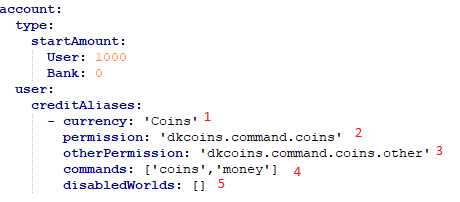

# User Bank Commands

This page describes the usage and permissions of the User Bank commands. The bank command always 
starts with the configured currency in config `/<currency>`.

Important things to remember:

* Required arguments are declared with ```<example>```
* Optional arguments are declared with ```[example]```

#### Configuration


Legend:<br/>
1: The currency name for this command. The currency must exist.<br/>
2: The required permission to execute this command and interact with yourself.<br/>
3: The required permission to execute this command and see other coins.<br/>
4: The configured command names. The first command in the array is the main name of the command and all other configured commands are managed as aliases.<br/>
5: The worlds, where the command should not work. This is only available on service level (Bukkit, Spigot, etc.)<br/>

#### Index

* [```/<command>```](#bank-list)
* [```/<command> <target>```](#bank-list)
* [```/<command> transfer <receiver> <amount>```](#bank-list)
* [```/<command> top [page]```](#bank-list)
***

## **```/<currency>```**

**Permission:** Configured permission ``permission`` [For more information](#Configuration)<br/>

This is the base command for the user bank command. This commands shows your balance for the configured currency.

***

## **```/<currency> <target>```**

**Permission:** Configured permission ``otherPermission`` [For more information](#Configuration)<br/>
**Arguments:**
* `target` the target name of a player

This command shows the balance of ``target`` for the configured currency.

***

## **```/<currency> transfer <receiver> <amount>```**

**Permission:** Configured permission ``otherPermission`` [For more information](#Configuration)<br/>
**Arguments:**
* `<receiver>` The receiver bank
* `<amount>` The amount to be transferred

This command transfer money from your bank to ``target`` bank in the configured currency. 

***

## **```/<command> top [page]```**

**Permission:** Configured permission ``otherPermission`` [For more information](#Configuration)<br/>
**Arguments:**
* `[page]` The limit of users to display (Default: 1)

This command shows the top bank accounts for the [configured currency](#Configuration). The entries per 
page are defined in the dkcoins config in the section``command.top.entriesPerPage`.

***