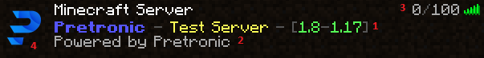
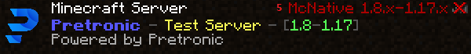

# Definitions

This page describes the key definitions and the structure of DKCoins. It is very important that you understand these things before you start using DKCoins.

## Motd template

A motd template represents the configuration of a motd to be shown to a player in the minecraft client server list.
It has several configuration possibilities. First the ``name`` is a unique identifier for a template.

Legend: 
1: Baseline 
2: Secondlines, which are random used from all second lines of the motd template 
3: Default or custom version text 
4: Favicon 
5: Wrong version text, which will be shown for clients with the wrong client version 
6: Player info, which will be shown while hovering on the version text 